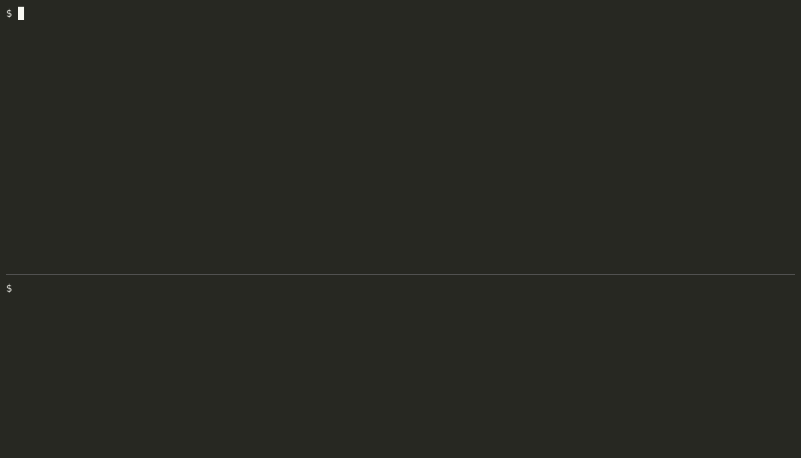
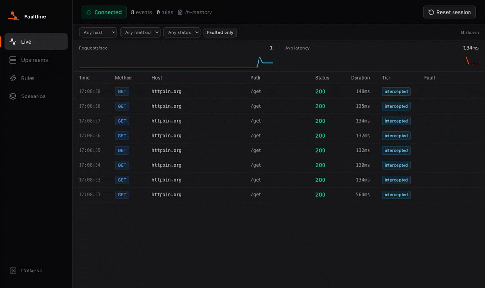

<picture>
  <source media="(prefers-color-scheme: dark)" srcset="docs/assets/logo-dark.svg">
  
</picture>

Faultline shows developers what their application says to the outside world,
and lets them make that world misbehave on purpose. It sits between an
application and the services it depends on, shows every outbound call live, and
can slow those calls down, fail them, cut them off, or make them flaky, so you
can see how the application copes before a real outage does it for you.

It is one binary, it works on real traffic rather than mocks, and its front door
is one command around the one you already use:

```
faultline run -- <your app's start command>
```



## Install

macOS and Linux:

```
curl -fsSL https://raw.githubusercontent.com/josipmusa/faultline/main/install.sh | sh
```

The script checks what it downloaded against the checksums published with the
release before it installs anything. It puts the binary in `~/.local/bin`, or in
`/usr/local/bin` when run as root, and never asks for sudo on its own;
`FAULTLINE_INSTALL_DIR` and `FAULTLINE_VERSION` override either choice.

macOS, from the tap:

```
brew install josipmusa/tap/faultline
```

In a Node project, with nothing to install first:

```
npx faultline-proxy run -- npm run dev
```

Windows, and anywhere you would rather read a script before you run it, from the
[latest release](https://github.com/josipmusa/faultline/releases/latest): unpack
the archive for your platform and put `faultline` on your `PATH`. There is a
container image too, described in [docs/docker.md](docs/docker.md):

```
docker run --rm -p 9000:9000 -p 9001:9001 ghcr.io/josipmusa/faultline:latest
```

`go install github.com/josipmusa/faultline/cmd/faultline@latest` also works, with
one difference worth knowing: it gives you the CLI, the HTTP API and the MCP
server but not the web UI. The UI is a Next.js export embedded at build time, and
`go install` has no Node toolchain to produce one, so the binary serves a note at
`/` saying so. Everything else behaves the same.

Releases are signed and carry build provenance;
[SECURITY.md](SECURITY.md#verifying-a-release) says how to check one.

## Five minutes

You need an application that makes HTTP calls. Any will do; the steps below use
the small Go client in this repository, which calls `https://httpbin.org/get`
once a second and logs what it got.

**1. Start the application through Faultline.** Nothing in the application
changes: Faultline sets the proxy variables and the CA trust variables for the
process it starts, and the process is none the wiser.

```
$ faultline run -- go run ./examples/go-client -every 1s -retries 2 -backoff 500ms
admin: http://127.0.0.1:9000
proxy: http://127.0.0.1:9001
tls: intercepting HTTPS with CA "/home/you/.config/faultline/ca.crt"
bypass: localhost, 127.0.0.1, ::1
2026/09/14 17:01:50 call 1: 200, 273 bytes, 604ms
2026/09/14 17:01:51 call 2: 200, 273 bytes, 175ms
```

**2. See what it calls.** Open http://127.0.0.1:9000 and watch the calls arrive,
or ask from another shell:

```
$ faultline upstreams
HOST         TIER         REQUESTS  FAULTED  ERRORS  LAST SEEN  NOTE
httpbin.org  intercepted  7         0        0       17:01:57   -
```

`intercepted` means Faultline can see inside the HTTPS calls, so every fault
applies. A host at tier `encrypted` takes connection faults only until the
application trusts the Faultline CA; [docs/trust.md](docs/trust.md) says what
that takes for each runtime, and for Go on macOS it is one command.

**3. Make it slow.**

```
$ faultline rule add --host httpbin.org --fault delay --set ms=2000
ID                    ENABLED  MATCH        FAULT          BEHAVIOR  NAME
delay-on-httpbin-org  yes      httpbin.org  delay ms=2000  -         delay on httpbin.org
```

The application's log shows what its users would feel:

```
2026/09/14 17:02:00 call 8: 200, 273 bytes, 2.138s
2026/09/14 17:02:03 call 9: 200, 273 bytes, 2.141s
```

**4. Make it fail, twice.** Remove the delay and add a rule that answers 503
for the first two calls, then recovers:

```
$ faultline rule rm delay-on-httpbin-org
$ faultline rule add --host httpbin.org --fault status --set code=503 --behavior first_n --behavior-set n=2
```

```
2026/09/14 17:02:04   attempt 1 failed (upstream answered 503), retrying in 500ms
2026/09/14 17:02:05   attempt 2 failed (upstream answered 503), retrying in 1s
2026/09/14 17:02:06 call 10: 200, 273 bytes, 1.645s, 3 attempts
```

**5. Read the report.** Stop the application, and Faultline says what it did
under the faults it was given:

```
report: this run
REQUESTS  FAULTED  RETRIES  MAX RETRY WAIT  ABANDONED
16        4        2        1003ms          0
```

Four calls were broken, the application tried again twice, waited about a
second at most, and abandoned nothing. Every number describes real traffic:
Faultline never invents a response for an upstream it did not reach.

**6. Keep it.** `faultline save` writes the rules to a `faultline.yaml` the
next run reads, and a named set of them is a scenario a whole test suite can
run under:

```
faultline run --scenario payments-down --report report.json -- go test ./...
```



## Documentation

| | |
| --- | --- |
| [docs/attach.md](docs/attach.md) | how traffic reaches Faultline: wrap, container companion, explicit route, and why browser traffic needs one |
| [docs/faults.md](docs/faults.md) | every fault and behavior, with an example of each |
| [docs/reference.md](docs/reference.md) | every key in `faultline.yaml` and every parameter with its bounds, generated from the catalogue |
| [docs/config.md](docs/config.md) | the configuration file: scenarios, hot reload, what gets written back |
| [docs/cli.md](docs/cli.md) | the command line, sessions and reports, using it from tests |
| [docs/api.md](docs/api.md) | the HTTP API: every endpoint, the error shape, the WebSocket envelope |
| [docs/trust.md](docs/trust.md) | HTTPS interception and what each runtime needs to trust the CA |
| [docs/docker.md](docs/docker.md) | the container image, Compose, `compose inject`, transparent mode |
| [docs/agents.md](docs/agents.md) | the MCP server and its tools, for coding agents |
| [docs/ci.md](docs/ci.md) | the GitHub Action: installing Faultline on a runner, wrapping a test suite |
| [docs/security.md](docs/security.md) | what Faultline exposes while it works: the CA, captured traffic, the unauthenticated admin port |
| [docs/troubleshooting.md](docs/troubleshooting.md) | symptom by symptom |
| [examples/](examples/) | small Go, Node, Spring Boot and Vite applications, and two Compose arrangements |

The same capabilities are available from the web UI on port 9000, the command
line, the HTTP API under `/api`, and the MCP server. They all act on the same
state, so a rule added in one place is the rule the others see.

## For coding agents

Faultline ships a skill, `resilience-check`, that teaches a coding agent when to
reach for fault injection and how to run a check end to end: see what the
application really calls, break one dependency, exercise it, and read what the
application did. It carries method rather than a catalogue, so it never goes
stale as faults are added, and it drives the command line, so it works for an
agent with no MCP server attached.

In Claude Code, this repository is also a plugin:

```
/plugin marketplace add josipmusa/faultline
/plugin install faultline@faultline
```

In any other harness, the [`skills`](https://skills.sh) CLI installs it
straight from this repository into whichever agent directories it finds on the
machine, with nothing to clone or copy:

```
npx skills add josipmusa/faultline
```

The skill names no harness and no paths, so it works the same wherever it
lands. An agent gets more out of it with the [MCP server](docs/agents.md)
attached:

```
claude mcp add faultline -- faultline mcp
```

## Contributing

[CONTRIBUTING.md](CONTRIBUTING.md) has what you need to build and test it.

## License

MIT. See [LICENSE](LICENSE).
